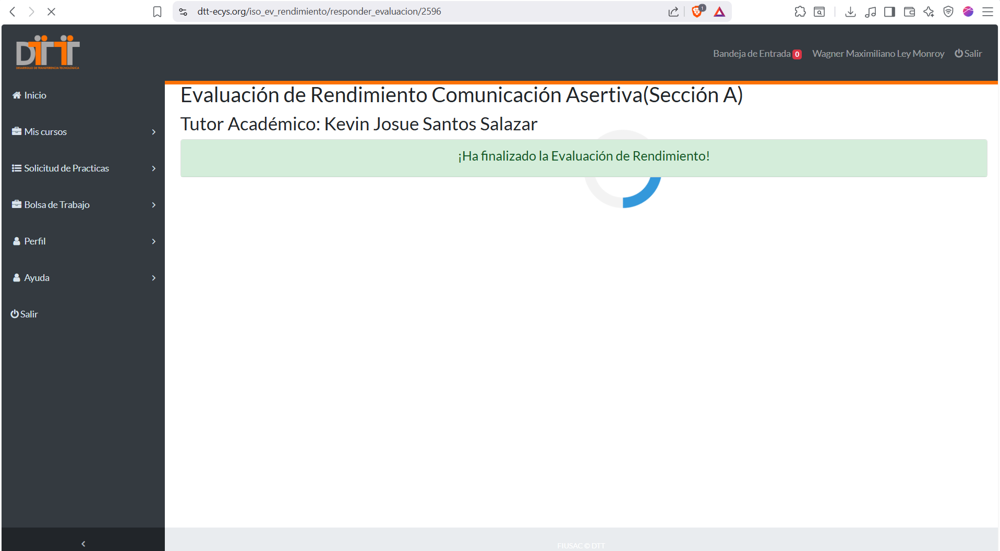
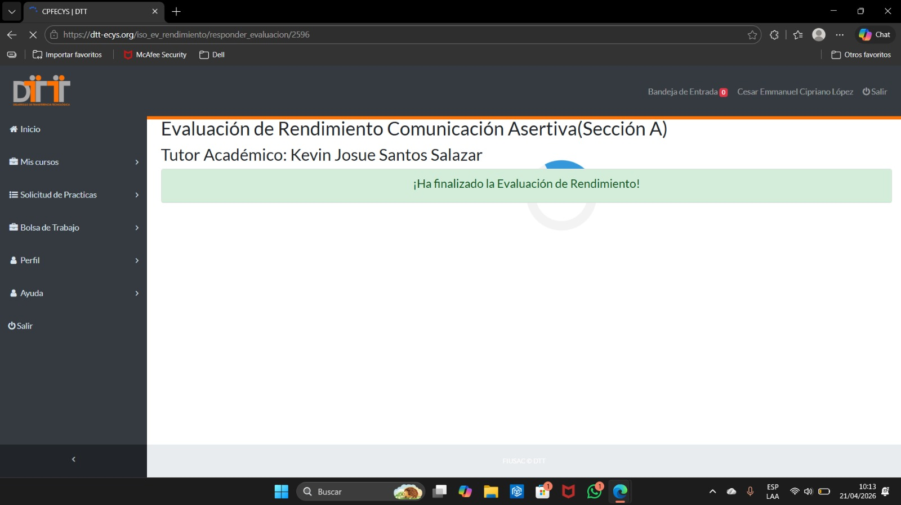
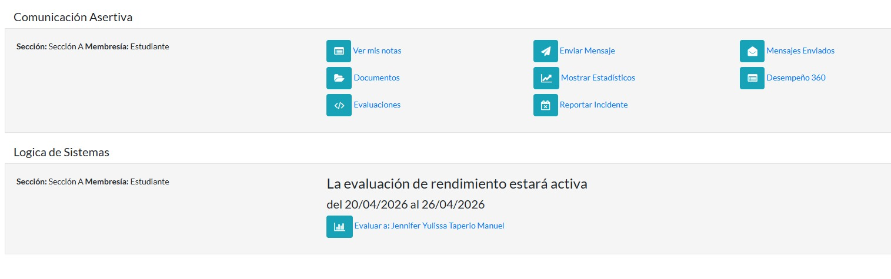

# Micropropuesta: Reducción de tiempos de reunión

---

## 1. Problema

Actualmente, las reuniones del equipo son largas, poco estructuradas y generan bajo nivel de productividad. En muchos casos, se extienden más de una hora sin una agenda clara, lo que provoca distracciones, repetición de información y falta de decisiones concretas.

---

## 2. Evidencia

Durante las últimas semanas, se ha observado que:

- Las reuniones duran entre 60 y 80 minutos.  
- Parte del tiempo se pierde esperando a participantes o tratando temas irrelevantes.  
- Menos del 25% del tiempo se utiliza para tomar decisiones.  

Además, estudios indican que más del 60% del tiempo en reuniones se desperdicia en temas innecesarios, lo que afecta directamente la eficiencia del equipo.

---

## 3. Solución

Se propone implementar un nuevo formato de reuniones basado en los siguientes puntos:

- Duración máxima de 15 minutos por reunión.  
- Agenda obligatoria compartida previamente.  
- Enfoque exclusivo en temas definidos.  
- Definición de tareas concretas al finalizar.  
- Uso de un cronometrista para controlar el tiempo.  

Si un tema requiere más análisis, se programará una reunión adicional solo con los involucrados.

---

## 4. Beneficio

La implementación de este formato generará:

- Aumento en la productividad del equipo.  
- Reducción del tiempo perdido en reuniones innecesarias.  
- Mayor claridad en las tareas asignadas.  
- Mejor uso del tiempo laboral.  

Se estima que se pueden recuperar hasta 45 minutos por reunión, lo que representa varias horas productivas adicionales por semana.

---

## 5. Credibilidad

Empresas reconocidas han adoptado estrategias similares, logrando mejoras significativas en productividad y eficiencia. Asimismo, diversos estudios respaldan que las reuniones cortas y estructuradas permiten una mejor toma de decisiones y mayor enfoque en resultados.

---

## 6. Estructura del mensaje

La propuesta se presenta de forma clara y ordenada:

1. Identificación del problema  
2. Presentación de evidencia  
3. Propuesta de solución  
4. Beneficios esperados  
5. Sustento con datos y ejemplos  

---

## 7. Estilo de comunicación

La propuesta utiliza:

- Voz activa  
- Lenguaje claro y directo  
- Ideas concisas  
- Enfoque persuasivo  

---

## 8. Implementación

Se propone realizar una prueba piloto de 5 días hábiles aplicando el nuevo formato de reuniones. Posteriormente, se evaluarán los resultados en términos de tiempo y productividad para decidir su adopción permanente.

---

# Propuesta de persuasión 

## César — Problema + Evidencia

“Comienzo con un número: en las últimas dos semanas, este equipo acumuló 24 horas de reuniones semanales. Siete reuniones distintas. ¿El resultado? Tareas retrasadas, gente cansada y decisiones que vuelven a discutirse una y otra vez.

El problema no es que nos reunamos. El problema es cómo nos reunimos: sin agenda clara, sin límite de tiempo, sin roles definidos. Una reunión de ‘actualización’ termina siendo una hora donde tres personas hablan y las otras siete miran el techo.”

---

“Pongamos evidencia concreta. La semana pasada tuvimos una reunión de ‘planificación semanal’ que duró 1 hora con 20 minutos. De ese tiempo:

- 25 minutos esperando a que llegara una persona.  
- 30 minutos discutiendo un tema que solo concernía a dos miembros.  
- 15 minutos repitiendo información que ya estaba en el chat.  
- Solo 10 minutos de decisiones reales.  

Eso no es una reunión. Es una pérdida de recursos.”

---

“Y no somos un caso aislado. Un estudio encontró que el 71% de los profesionales considera que las reuniones largas son improductivas y que más del 60% del tiempo de reunión se desperdicia en temas irrelevantes.

En empresas como Google o Shopify, ya prohibieron las reuniones sin agenda. Shopify incluso eliminó todas las reuniones recurrentes de más de 3 personas. ¿Y qué pasó? La productividad aumentó, no cayó.”

---

“Entonces, preguntémonos: ¿cada reunión larga que tenemos realmente suma valor? ¿O solo suma minutos al calendario?

Yo digo que estamos perdiendo tiempo valioso que podríamos usar para entregar, mejorar o incluso descansar.

Por eso, con Max y Daniel, les traemos una solución concreta. Max, continúa.”

---

## Max — Solución + Beneficio

“Gracias, César. La solución es simple, gratuita y ya funciona en decenas de equipos de alto rendimiento:

Reuniones de máximo 15 minutos con agenda obligatoria compartida 24 horas antes.

No es una moda. Se basa en un principio: si no puedes resolverlo en 15 minutos, probablemente no es una reunión de equipo, es una reunión de subgrupo.”

---

“¿Cómo lo aplicamos exactamente? Tres reglas:

*Regla 1: Agenda obligatoria*
- ¿Qué vamos a revisar? (máximo 3 temas)  
- ¿Qué vamos a decidir?  
- ¿Quién hace qué después?  

*Regla 2:* Un cronometrista rotativo. A los 15 minutos exactos, se cierra la reunión.

*Regla 3:* Si un tema no termina, se agenda otra reunión solo con los involucrados.”

---

“¿El beneficio? Vamos a los números.

Si reducimos una reunión de 1 hora a 15 minutos, recuperamos 45 minutos por reunión.  
Con 5 reuniones a la semana: 3 horas 45 minutos por persona.  
En un equipo de 8 personas: 30 horas semanales recuperadas.

Eso es medio empleado de tiempo completo.”

---

“¿Funciona? Sí.

Equipos reales han aumentado productividad hasta en un 30% y reducido reuniones en más del 60%.

Propongo una prueba de una semana. Medimos resultados y comparamos.

Daniel, el cierre es tuyo.”

---

## Daniel — Cierre + Llamada a la acción

“Gracias, Max.

Ahora les pregunto:  
¿cuántas veces salieron de una reunión sin saber qué hacer?  
¿cuántas veces perdieron una hora que no vuelve?

Eso no es disciplina. Es el formato.

Nuestra propuesta no es mejorar reuniones. Es cambiar las reglas del juego.”

---

“La estructura es simple:

- Sin agenda, no hay reunión.  
- Minuto 1: objetivo claro.  
- Minutos 2–13: solo lo importante.  
- Minuto 14: acciones concretas.  
- Minuto 15: se termina.  

Esto es respeto por el tiempo.”

---

“¿Qué ganamos?

- Claridad  
- Decisión  
- Energía  
- Resultados medibles  

Yo llevaré el registro y lo presentaré en la próxima reunión.”

---

“Propuesta final:

Desde el lunes, implementamos reuniones de 15 minutos por 5 días.

Yo creo la plantilla.  
César controla el tiempo.  
Max trae resultados.

No es permanente. Es una prueba.”

---

“Última pregunta:

¿prefieren una hora de conversación…  
o 15 minutos de decisiones?

Si están de acuerdo, levanten la mano.

Porque el tiempo no se recupera…  
pero sí se puede usar mejor.

Gracias.”

